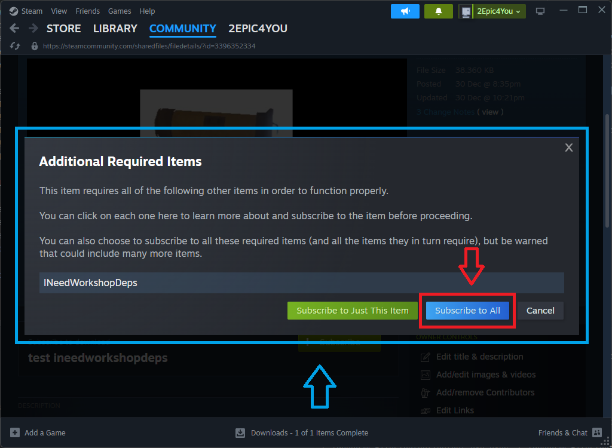
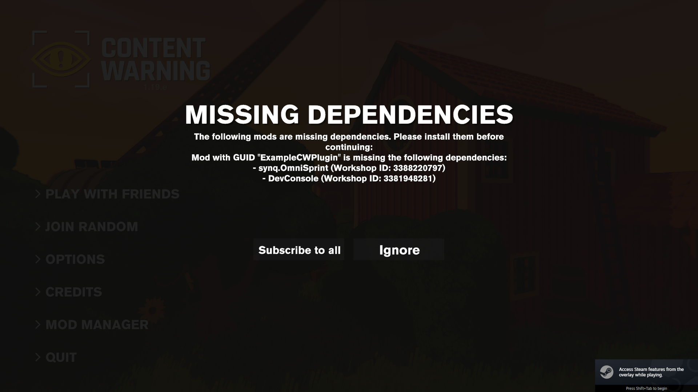
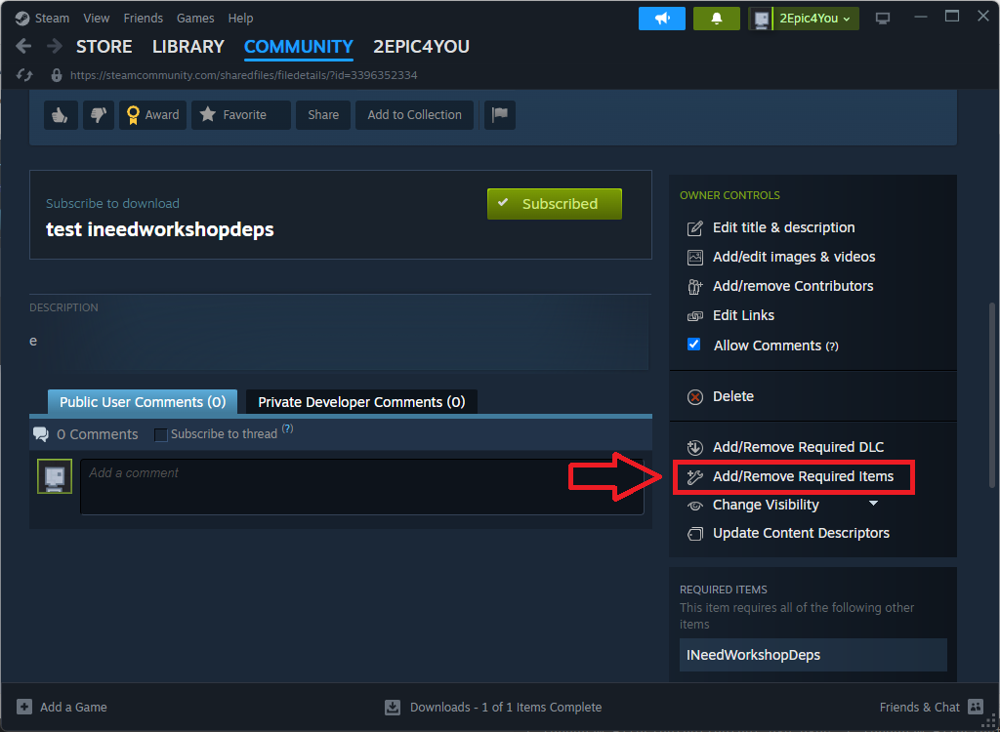
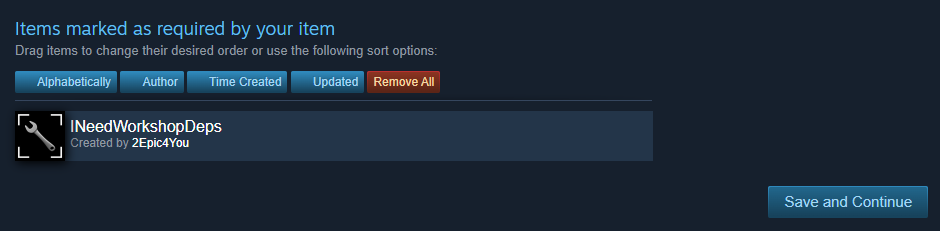
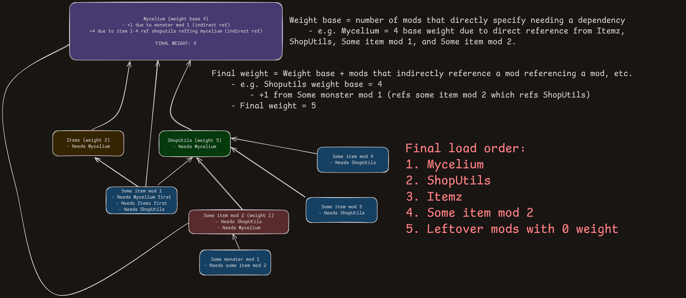

# INeedWorkshopDeps
A Content Warning Workshop mod which allows other Workshop mods to have dependencies on it.

## How to use as a player
1. Subscribe to any mod you want. If it uses INeedWorkshopDeps, and the dev of the mod you want is not brain-dead, you
   will see this:
    - 
2. Click "Subscribe to all".
3. Done! You can now launch the game. If you are missing any mods, you will see a message like this:
    - 
4. Click "Subscribe to missing" to subscribe to the mods you are missing.
5. Relaunch the game to load the mods you just subscribed to, and you're done!

*"Why not use just normal Steam workshop dependencies?"*

Good question! The game loads Steam mods in a random order. So, let's say you have two mods. Mod A depends on Mod B.
If Mod A loads before Mod B, Mod A will crash because it can't find Mod B.
This mod fixes that by making sure all dependencies are loaded before the mod that depends on them.
It also makes sure that the user is subscribed to all dependencies before loading the mod that depends on them, just
like normal Steam UI!

To see a more detailed explanation of the load order, see the [Load order](#load-order) section.

## How to use as a mod dev
1. Add a reference to INeedWorkshopDeps.dll in your project.
2. When you want to specify other **Steam Workshop mods** as dependencies, add the `[ContentWarningDependency]`
   attribute to your mod's main class, and pass the GUIDs of the mods you depend on as arguments.
    - You will need the mod's GUID and workshop ID. You can get the GUID by finding the `[ContentWarningPlugin]`
      attribute in the DLL of the mod you want to depend on.
    - You cannot **not** specify the workshop ID! **You must include it**. You can find the workshop ID by looking at
      the URL of the mod's Steam Workshop page.
    - Example: `https://steamcommunity.com/sharedfiles/filedetails/?id=1234567890` has a workshop ID of `1234567890`.
3. When you upload your mod to the Steam Workshop, make sure you tell Steam to ask the user to subscribe to the [
   `INeedWorkshopDeps`][inwd] workshop mod too.
    - This can be done by clicking on "Add/Remove Required Items" on your mod's workshop page.
    - 
    - Then click on the "Subscribed items" tab, and search for `INeedWorkshopDeps`. If you don't see it, make sure
      you're subscribed to [INeedWorkshopDeps][inwd]!
    - 
    - It should look something like the above when done. You can now press "Save and Continue" to save your changes.

### Example
```cs
[ContentWarningPlugin("ExampleCWPlugin", "0.1", false)]
[ContentWarningDependency("synq.OmniSprint", 3388220797)] // GUID, Workshop ID
[ContentWarningDependency("blabla.blabla", 1234567890)] // GUID, Workshop ID
public class ExampleCWPlugin
{
    static ExampleCWPlugin()
    {
        Debug.Log("Hello from ExampleCWPlugin! This is called on plugin load");
    }
}
```
(You can add as many dependencies as you want just by adding more `[ContentWarningDependency]` attributes)

## Load order
[.excalidraw file](Diagrams/LoadOrder.excalidraw) or [Excalidraw URL](https://excalidraw.com/#json=Lh_bmIjfW9n4lfo8CpJNa,zB39MNK2B4rpYQ-FwWgDDA)


[inwd]: https://steamcommunity.com/sharedfiles/filedetails/?id=3396439930